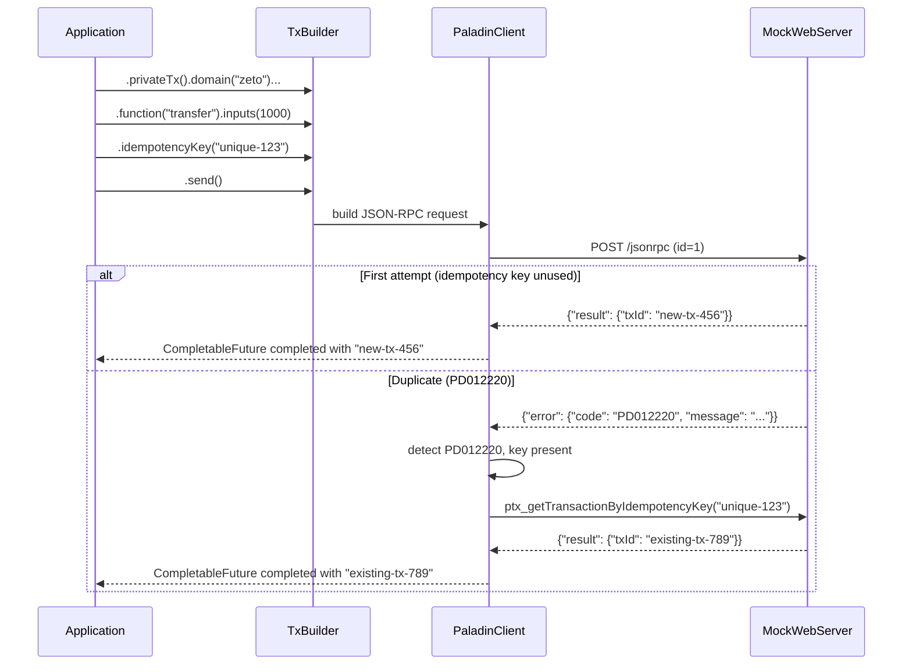
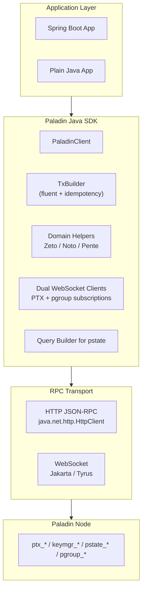
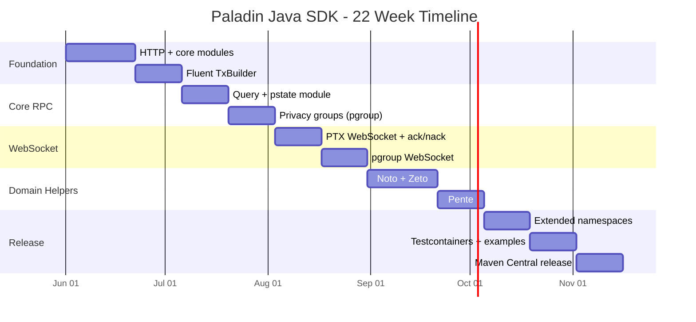

# Paladin Java SDK (Micro-PoC)

> **Status:** Proof of Concept for LFX Mentorship Application (Jun-Nov 2026)

This repository contains a focused Proof of Concept (PoC) demonstrating the core architectural philosophy proposed for the Paladin Java SDK.

## Scope: Depth over Breadth

This PoC implements a small but **production‑grade** slice of the `ptx` namespace, prioritising:

1. **Fluent `TxBuilder`** - guided, chainable, IDE‑friendly transaction construction.
2. **Automatic `PD012220` Recovery** - transparent fallback to `ptx_getTransactionByIdempotencyKey` for idempotency clashes.

The remaining RPC methods (`pstate_*`, `pgroup_*`, WebSockets, domain helpers) are design‑aligned in the proposal and will be incrementally delivered during the mentorship, maintaining the same quality standard.

## Design: Fluent Transaction Builder

The builder pattern provides compile‑time safety, deferred error validation, and a self‑documenting API.

**Example usage:**

```java
client.newTransaction()
    .privateTx()
    .domain("zeto")
    .function("transfer")
    .to("0x...")
    .inputs(1000)
    .idempotencyKey("payment-ref-123")
    .send();
```

## 🛡️ Resilience: Idempotency Recovery

In distributed financial systems, network failures can cause duplicate transaction submissions. Paladin nodes reject duplicates with error code `PD012220` (Idempotency Clash).

This PoC implements the same recovery behaviour as the Go SDK: when `PD012220` is detected, the client automatically calls `ptx_getTransactionByIdempotencyKey` and returns the existing transaction ID - ensuring the calling application sees a success without any retry logic.



## The Payoff: Domain Helpers
The ultimate goal of this architecture is to make life easy for the application developer. Because the core `TxBuilder` handles type safety and error recovery, building higher-level Domain Helpers (like Zeto or Noto) becomes trivial. 

Instead of dealing with raw RPC maps, developers can just do this:
```java
ZetoHelper zeto = new ZetoHelper(client);
zeto.transfer("alice@node1", "bob@node2", 500, "invoice-123").join();
```

## Running the Tests

The PoC uses `MockWebServer` to simulate the `PD012220` error path deterministically, without requiring a live Paladin node.

```bash
mvn clean test
```

## Project Vision (Beyond the PoC)

This PoC is the foundation for a complete Paladin Java SDK. The full SDK will include:



**Implementation Roadmap (22 weeks, part-time):**



## Next Steps (Mentorship Scope)

- Full `ptx` parity (dispatch queries, blockchain event listeners)
- Domain helpers for Noto, Zeto, and Pente
- Dual WebSocket clients with ack/nack and auto‑reconnect
- State store query builder
- Testcontainers integration suite
- Maven Central publication
